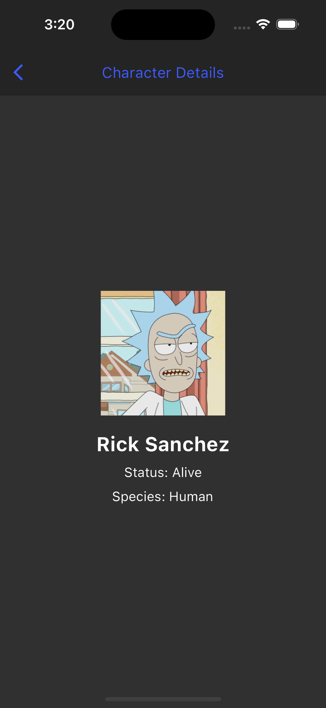

# flutter_clean_arch_templ

A Flutter Rick and Morty App in Clean Architecture.

  
Flutter Interview Questions

1. **What is the difference between a StatelessWidget and a StatefulWidget in Flutter?**
   - `StatelessWidget`: Represents a widget that cannot change its internal state once it's built. It's used for UI elements that don't need to be updated dynamically.
   - `StatefulWidget`: Represents a widget that can change its internal state and trigger a rebuild when that state changes. It's used for dynamic UI elements that need to respond to user interactions or data changes.

2. **Explain the Stateful Widget Lifecycle?**
   - `createState`: Initializes the mutable state of the widget.
   - `build`: Rebuilds the widget in response to state changes.
   - `didUpdateWidget`: Called when the parent widget changes and the state needs to be updated.
   - `dispose`: Called when the widget is removed from the tree, allowing for cleanup.

3. **When do you use the WidgetsBindingObserver?**
   - You use `WidgetsBindingObserver` to listen for application lifecycle events like `didChangeAppLifecycleState`. It's useful for handling scenarios when your app goes into the background or returns to the foreground.

4. **What is Flutter tree shaking?**
   - Tree shaking is a process where Flutter's build tools eliminate unused code and resources from the final app bundle. This helps reduce the app's size by removing unnecessary components.

5. **What is a Spacer widget?**
   - `Spacer` is a widget that takes up available space along the main axis in a `Row` or `Column`. It's used to distribute space evenly among other widgets.

6. **What is the difference between hot restart and hot reload?**
   - Hot Restart: Restarts the entire app and reloads all code, including the app's initial state. It's slower but helps fix some errors.
   - Hot Reload: Reloads only the updated code and state without restarting the app. It's faster and used during development to see changes quickly.

7. **What is an InheritedWidget? List some examples.**
   - `InheritedWidget` is a way to share data down the widget tree. Examples include `Theme`, `MediaQuery`, and custom data-sharing widgets.

8. **Why is the build() method on State and not StatefulWidgets?**
   - The `build()` method is on the `State` class because it represents the mutable state of a `StatefulWidget`. The `State` object is responsible for rendering the UI based on that state.

9. **What is a pubspec file in Dart?**
   - A `pubspec.yaml` file is used to define the metadata and dependencies for a Dart package, including Flutter apps. It specifies package name, version, dependencies, and other project settings.

10. **How is Flutter native?**
    - Flutter compiles to native machine code for the target platform (e.g., ARM for Android). It uses the platform's native widgets and has direct access to platform-specific features, making it native in performance and look.

11. **What is a Navigator and what are Routes in Flutter?**
    - `Navigator` manages a stack of `Route` objects, which represent screens or pages in a Flutter app. It allows you to navigate between different parts of your app.

12. **What is a PageRoute?**
    - A `PageRoute` is a route that transitions between pages or screens in a Flutter app. Examples include `MaterialPageRoute` and `CupertinoPageRoute`.

13. **Explain async, await and Futures.**
    - `async` and `await` are used for asynchronous programming in Dart and Flutter.
    - `async` marks a function as asynchronous, and `await` is used to pause the function's execution until a `Future` completes.
    - `Future` represents a potential value or error that will be available at some point in the future.

14. **How can you update a ListView dynamically?**
    - You can update a `ListView` dynamically by modifying the underlying data source (e.g., a `List`) and then calling `setState()` to trigger a rebuild of the widget tree.

15. **What is a Stream?**
    - A `Stream` is a sequence of asynchronous events or data. It allows you to receive and process data as it becomes available, often used for real-time data handling.

16. **What are keys in Flutter and when should you use them?**
    - Keys are used to uniquely identify widgets in Flutter. They are useful when you need to rebuild a specific widget or manage widget state across rebuilds.

17. **What are GlobalKeys?**
    - `GlobalKey` is a special type of key that allows you to access and manipulate the state of a widget from anywhere in your app. It's often used with widgets like `Form` or `Scaffold` to interact with their state.

18. **When should you use mainAxisAlignment and crossAxisAlignment?**
    - `mainAxisAlignment` is used to align children along the main axis (e.g., horizontally in a `Row`).
    - `crossAxisAlignment` is used to align children along the cross axis (e.g., vertically in a `Row`).

19. **When can you use double.INFINITY?**
    - You can use `double.INFINITY` to indicate an unconstrained size for a widget, allowing it to take up as much available space as needed.

20. **What is Ticker, Tween, and AnimatedBuilder?**
    - `Ticker` is used to control animations in Flutter.
    - `Tween` defines a range of values for animations.
    - `AnimatedBuilder` is a widget used to build animations based on a `Tween` and a `Ticker`.

21. **What is ephemeral state?**
    - Ephemeral state refers to state that is local to a single widget and doesn't need to be shared or persisted beyond the widget's lifetime.

22. **What is an AspectRatio widget used for?**
    - `AspectRatio` is used to enforce a specific aspect ratio for its child. It resizes its child while maintaining the specified aspect ratio.

23. **How would you access StatefulWidget properties from its State?**
    - You can access `StatefulWidget` properties from its `State` using the `widget` property of the `State` class, like `widget.propertyName`.

24. **Is there a suggested limit to the number of FloatingActionButton a screen can have? Give a reason(s) for your answer.**
    - There is no strict limit, but it's advisable to keep the number of `FloatingActionButton` widgets reasonable to maintain a clean and user-friendly UI. Overloading a screen with too many buttons can make it confusing and cluttered.

25. **Mention two or more operations that would require you to use or return a Future.**
    - Network requests (e.g., fetching data from a server).
    - File operations (e.g., reading or writing files).
    - Database queries.
    - Long-running computations.

26. **What is the purpose of a SafeArea?**
    - `SafeArea` is used to ensure that the content within it is displayed within the safe, viewable area of the screen, avoiding areas like notches and system bars.

27. **When to use a mainAxisSize?**
    - `mainAxisSize` is used in `Row` and `Column` widgets to control how they allocate space along their main axis.

 You use it to determine whether the widget should take up as much space as possible (`MainAxisSize.max`) or as little as possible (`MainAxisSize.min`).

28. **SizedBox VS Container?**
    - `SizedBox` is a simple box with a fixed size. It doesn't have child widgets.
    - `Container` can contain child widgets and provides more styling options like padding, margin, and decoration.

29. **List the Visibility widgets in flutter and the differences?**
    - The `Visibility` widget controls the visibility of its child.
    - The `Offstage` widget also hides its child but doesn't allocate space for it.

30. **Can we use Color and Decoration property simultaneously in the Container? Explain.**
    - No, you generally can't use both `Color` and `Decoration` properties simultaneously in a `Container`. `Decoration` property is used for more advanced styling, and it overrides the `Color` property.

31. **In order for the CrossAxisAlignment.baseline to work, what is another property that we need to set?**
    - To use `CrossAxisAlignment.baseline`, you need to specify the `baseline` property in the `TextBaseline` enum for the children you want to align along their baselines.

32. **When should we use a resizeToAvoidBottomInset?**
    - `resizeToAvoidBottomInset` should be used when you want to automatically resize the body of a `Scaffold` to avoid the on-screen keyboard (soft keyboard) that might cover the text fields or input elements.

33. **What is the difference between 'as,' 'show,' and 'hide' in an import statement?**
    - `as` is used to create an alias for an imported library or symbol.
    - `show` is used to explicitly import only specific symbols from a library.
    - `hide` is used to exclude specific symbols from being imported from a library.

34. **What is the importance of a TextEditingController?**
    - `TextEditingController` is used to control and manipulate the content of a text input field (e.g., `TextField`). It allows you to read and modify the text input's value.

35. **Why do we use a Reverse property in a ListView?**
    - The `reverse` property in a `ListView` is used to reverse the order of its children. This can be useful when you want to display a list in reverse chronological order, such as a chat history.

36. **Difference between a Modal and Persistent BottomSheet with an example?**
    - A modal bottom sheet covers the entire screen when displayed and is typically used for actions or selections that need user attention.
    - A persistent bottom sheet is a smaller sheet that remains visible at the bottom of the screen and is often used for additional information or controls.

37. **How is an Inherited Widget different from a Provider?**
    - `InheritedWidget` is a Flutter class for sharing data across the widget tree, whereas "Provider" is a design pattern or library for state management that can use `InheritedWidget` under the hood but provides additional features and flexibility.

38. **What is an UnmodifiableListView?**
    - An `UnmodifiableListView` is a read-only view of a list that prevents modifications like adding or removing elements. It's useful when you want to expose a list without allowing external changes.

39. **Difference between these operators "?? and ?."**
    - `??` is the null coalescing operator and returns the right-hand value if the left-hand value is null.
    - `?.` is the conditional access operator and is used to access properties or methods of an object if the object is not null; otherwise, it returns null.

40. **What is the purpose of ModalRoute.of()?**
    - `ModalRoute.of(context)` is used to retrieve the current modal route in the widget tree. It allows you to access properties and methods of the current route, such as the route's name or settings.

41. **Difference between Navigator.pushNamed and Navigator.pushReplacementNamed?**
    - `Navigator.pushNamed` is used to push a new route onto the stack and add it to the navigation history.
    - `Navigator.pushReplacementNamed` is used to replace the current route in the stack with a new route. It removes the current route from the history.

42. **Difference between a Single Instance and Scoped Instance?**
    - In the context of state management, a single instance typically refers to a global singleton object that holds and manages application-wide state.
    - A scoped instance, on the other hand, is a state instance scoped to a specific part of the widget tree, often used with libraries like "Provider" to manage localized state within a widget subtree.

  
Flutter Animation Interview Questions

1. **What is a vsync?**
   - `vsync` stands for "vertical sync." In the context of animations in Flutter, it's a mechanism used to synchronize animations with the device's screen refresh rate. It helps ensure that animations are smooth and not out of sync with the screen's rendering.

2. **When does the animation reach completed or dismissed status?**
   - In Flutter's animation framework, an animation reaches the "completed" status when it has progressed from its initial state to its final state. Conversely, it reaches the "dismissed" status when it has reversed from the final state back to the initial state.

3. **Difference between `AnimationController` and `Animation`?**
   - `AnimationController` is a controller that manages an animation's state, duration, and other properties. It's responsible for controlling the animation's progression and can be used to start, stop, or reverse an animation.
   - `Animation` represents the current value of an animation at any given point in time. It doesn't control the animation's state but rather provides access to the animated values.

4. **When to use `SingleTickerProviderStateMixin` and `TickerProviderStateMixin`?**
   - `SingleTickerProviderStateMixin`: Use this mixin when you have only one `AnimationController` in your widget and want to provide it as a `vsync` to ensure smooth animations.
   - `TickerProviderStateMixin`: Use this mixin when you have multiple `AnimationController` instances in your widget and want to provide a `vsync` for each of them individually.

5. **Define a TweenAnimation?**
   - A TweenAnimation is an animation that uses a `Tween` to interpolate values between a specified range or values. It allows you to animate properties smoothly from one value to another. For example, animating the opacity of a widget from 0.0 to 1.0 using a `Tween<double>`.

6. **State the importance of a Ticker?**
   - A Ticker is a crucial part of Flutter's animation system. It provides a way to synchronize animations with the device's screen refresh rate (vsync), ensuring that animations appear smooth and visually appealing. Tickers help control the timing and progression of animations.

7. **Why do we need mixins?**
   - Mixins are a way to reuse and share code between classes in Dart and Flutter. They allow you to add features or behavior to a class without inheriting from that class, promoting code modularity and reusability.
   - In the context of Flutter animations, mixins like `SingleTickerProviderStateMixin` and `TickerProviderStateMixin` provide specific behavior (e.g., `vsync` capability) to widget classes without the need for multiple inheritance.

Mixins are valuable for creating flexible and maintainable code by allowing you to compose classes with different sets of behaviors while avoiding the constraints of single inheritance.

## App Structure

### Screenshots

    
